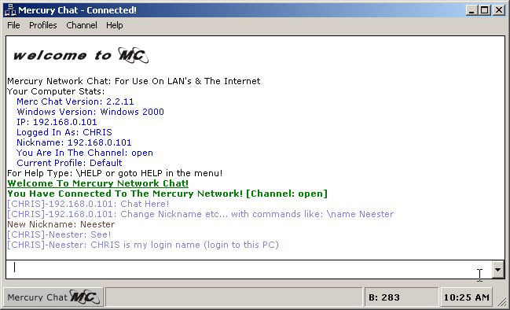



## Mercury Network Chat \- SERVERLESS LAN CHAT\!

### Description

The code is meant to be useided in a large office or school network.

It only works over LAN's, and restricted WAN's....

Its basically an IP chat program, but you never have to connect to anyone or any server!

Some Features Include:

:: Skinnable (Via Profiles) :: Profile Creator Wizard! :: Unlimited Channels :: Unlimited Private Channels :: Banning People :: Saving Chat As Word Document :: URL Detect

.

.

[EDIT] --- > FULL REPORT ON CHAT HERE:

http://www.neester.com/personal/mercurychat.pdf

PLEASE COMMENT!

AND PLEASE RATE THIS PROJECT!

THANX FOR YOUR VOTES!

KEEP THEM COMING!

THEY ARE GREATLY APPRECIATED!
 
### More Info
 

             |
---                |---
**Submitted On**   |2002-12-01 20:17:10
**By**             |[Chris Stratford](https://github.com/Planet-Source-Code/PSCIndex/blob/master/ByAuthor/chris-stratford.md)
**Level**          |Intermediate
**User Rating**    |5.0 (50 globes from 10 users)
**Compatibility**  |VB 4\.0 \(32\-bit\), VB 5\.0, VB 6\.0
**Category**       |[Internet/ HTML](https://github.com/Planet-Source-Code/PSCIndex/blob/master/ByCategory/internet-html__1-34.md)
**World**          |[Visual Basic](https://github.com/Planet-Source-Code/PSCIndex/blob/master/ByWorld/visual-basic.md)
**Archive File**   |[Mercury\_Ne15133312142002\.zip](https://github.com/Planet-Source-Code/chris-stratford-mercury-network-chat-serverless-lan-chat__1-41592/archive/master.zip)

